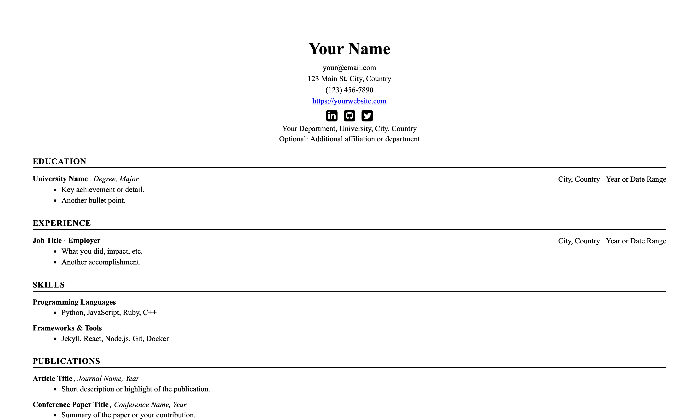
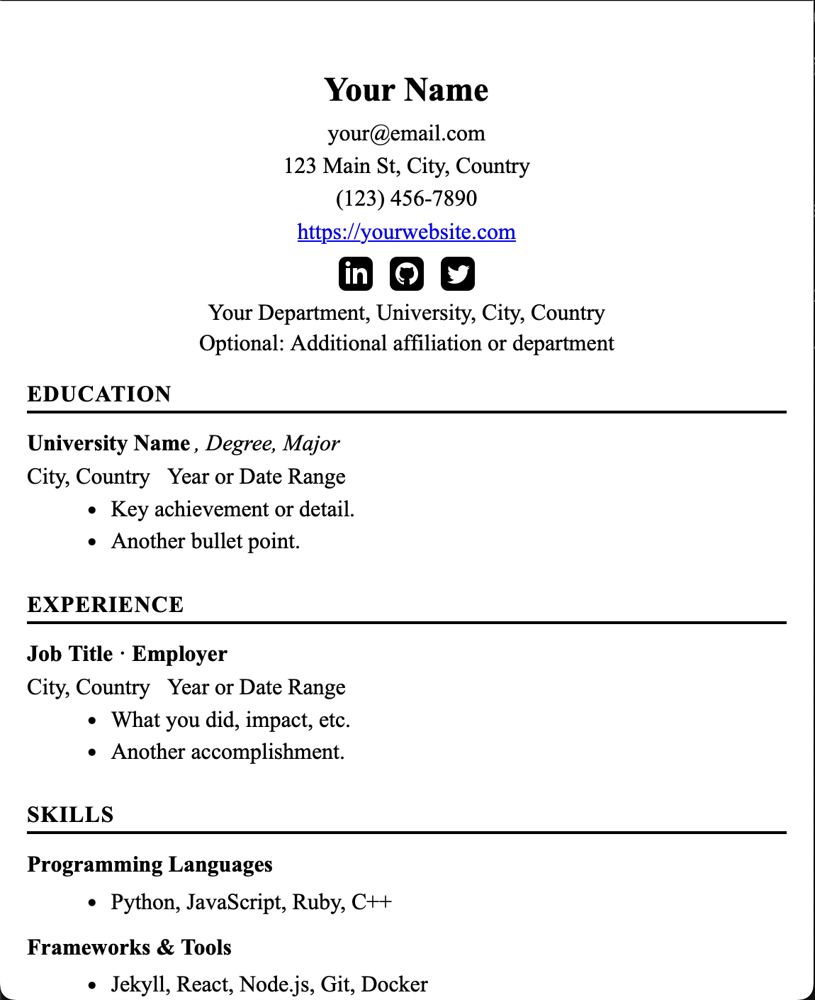

# Harvard‑Style CV Jekyll Template for GitHub Pages 🎓

A clean, professional CV template following the classic Harvard format. Perfect for academics, researchers, and professionals who want a timeless, print-friendly resume that works seamlessly on GitHub Pages.

## 🖼️ Screenshots

### Desktop


### Mobile


*If you don't see images above, add your own screenshots to the `assets/` folder!*

---

## 🚀 Quick Start

### Option 1: Remote Theme (Recommended)
Add this to your Jekyll site's `_config.yml`:

```yaml
remote_theme: smirnoffmg/harvard-style-cv-theme
```

Then create your own `_config.yml` and `_data/cv.yml` files with your information.

### Option 2: Fork & Customize
1. **Fork this repository** to your GitHub account
2. **Edit your CV content** in `_config.yml` and `_data/cv.yml`
3. **Enable GitHub Pages** in your repo settings
4. Visit `https://yourusername.github.io/your-repo-name` to see your CV!

---

## 📝 Configuration Examples

### `_config.yml` - Site Configuration
```yaml
# Basic Information
title: "Dr. Jane Smith"
email: "jane.smith@university.edu"
phone: "(555) 123-4567"
address: "123 Academic Street, Cambridge, MA 02138"
website: "https://janesmith.com"

# Professional Affiliation
department: "Department of Computer Science, Harvard University, Cambridge, MA"
affiliation: "Research Fellow, MIT Computer Science & AI Laboratory"

# Social Media (just usernames, not full URLs)
linkedin: janesmith
github: janesmith
twitter: janesmith
telegram: janesmith
leetcode: janesmith

# Optional: Google Analytics
google_analytics: G-XXXXXXXXXX

# Site Settings
description: "Harvard-style CV • Dr. Jane Smith"
baseurl: ""
url: "https://janesmith.github.io"
```

### `_data/cv.yml` - CV Content
```yaml
sections:
  - title: Education
    entries:
      - title: "Harvard University"
        sub: "Ph.D. in Computer Science"
        location: "Cambridge, MA"
        dates: "2018-2023"
        bullets:
          - "Dissertation: 'Advanced Machine Learning Algorithms for Natural Language Processing'"
          - "Advisor: Dr. John Doe"
          - "GPA: 3.9/4.0"
      
      - title: "MIT"
        sub: "M.S. in Computer Science"
        location: "Cambridge, MA"
        dates: "2016-2018"
        bullets:
          - "Thesis: 'Neural Network Optimization Techniques'"
          - "Graduated with distinction"

  - title: Experience
    entries:
      - title: "Research Scientist · Google Research"
        location: "Mountain View, CA"
        dates: "2023-Present"
        bullets:
          - "Lead research on large language models and their applications"
          - "Published 5 papers in top-tier conferences (NeurIPS, ICML)"
          - "Mentored 3 PhD students and 2 research interns"
      
      - title: "Graduate Research Assistant · Harvard University"
        location: "Cambridge, MA"
        dates: "2018-2023"
        bullets:
          - "Developed novel algorithms for natural language understanding"
          - "Collaborated with international research teams"
          - "Presented work at 8 international conferences"

  - title: Publications
    entries:
      - title: "Advanced Neural Architectures for Language Processing"
        sub: "NeurIPS 2023"
        bullets:
          - "Proposed a new transformer variant that improves efficiency by 40%"
          - "Cited 150+ times within 6 months of publication"
      
      - title: "Efficient Training Methods for Large Language Models"
        sub: "ICML 2022"
        bullets:
          - "Developed techniques to reduce training time by 60%"
          - "Open-sourced implementation with 500+ GitHub stars"

  - title: Skills
    entries:
      - title: "Programming Languages"
        bullets:
          - "Python, C++, JavaScript, Rust"
      
      - title: "Machine Learning & AI"
        bullets:
          - "PyTorch, TensorFlow, Transformers, Computer Vision"
      
      - title: "Tools & Platforms"
        bullets:
          - "Git, Docker, AWS, Google Cloud Platform"

  - title: Awards & Honors
    entries:
      - title: "NSF Graduate Research Fellowship"
        dates: "2018-2021"
        bullets:
          - "Prestigious fellowship for outstanding graduate students"
      
      - title: "Best Paper Award"
        sub: "ACL 2022"
        bullets:
          - "Recognized for innovative contributions to NLP field"
```

---

## ✨ Features

- **Classic Harvard layout** with bold centered name and structured sections
- **Print/PDF friendly** - looks crisp when printed or saved as PDF
- **Responsive design** - perfect on desktop, tablet, and mobile
- **Social integration** - LinkedIn, GitHub, Twitter, Telegram, LeetCode icons
- **Easy customization** - manage all content through simple YAML files
- **GitHub Pages ready** - works out of the box with no additional setup
- **SEO optimized** - built-in search engine optimization
- **CI/CD pipeline** - automated testing, building, and deployment
- **Semantic versioning** - automatic version management and releases

---

## 📖 Documentation

For detailed technical documentation, configuration guides, and troubleshooting:

📋 **[View Full Documentation](CONSTITUTION.md)**

The documentation includes:
- Complete configuration guide
- Data structure examples
- Customization options
- Troubleshooting solutions
- Technical constraints and architecture
- CI/CD pipeline and development workflow
- Branch protection and release management

---

## 🎯 Perfect For

- **Academics** and researchers
- **Graduate students** applying for programs
- **Professionals** seeking clean, traditional resumes
- **Anyone** who values classic, timeless design

---

## 📄 License

MIT — free to use, modify, and share.

---

## 🤝 Contributing

Found a bug or have a feature request? [Open an issue](https://github.com/smirnoffmg/harvard-style-cv-theme/issues) or submit a pull request!

---

**Ready to create your professional CV?** 🚀

[Fork this repository](https://github.com/smirnoffmg/harvard-style-cv-theme/fork) or [use as remote theme](#-quick-start) to get started!

